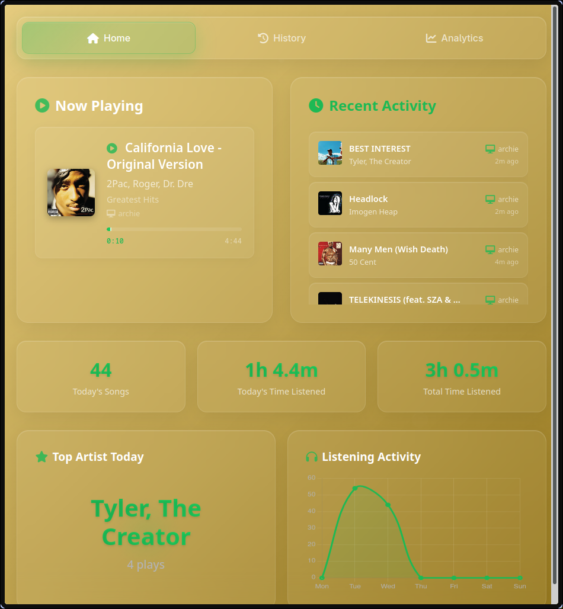
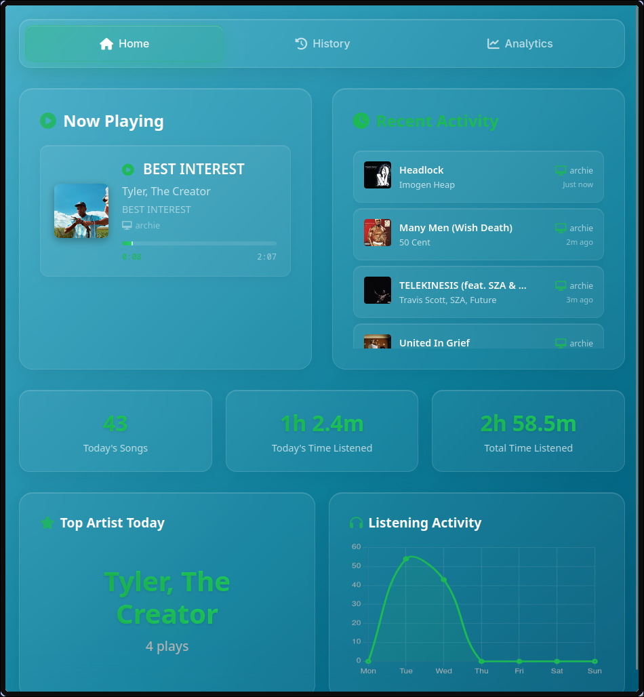
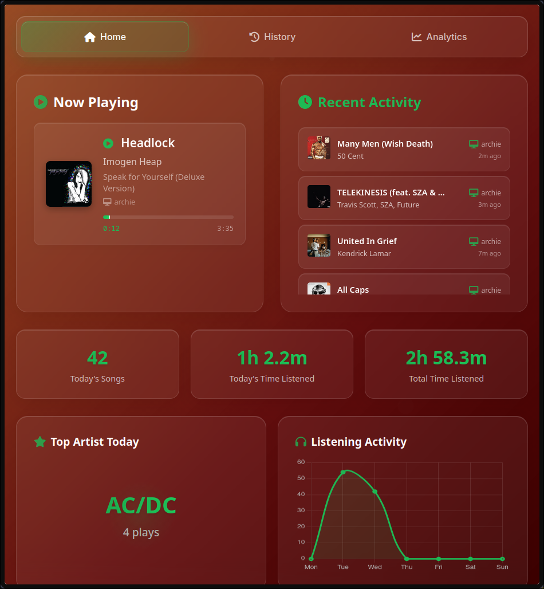
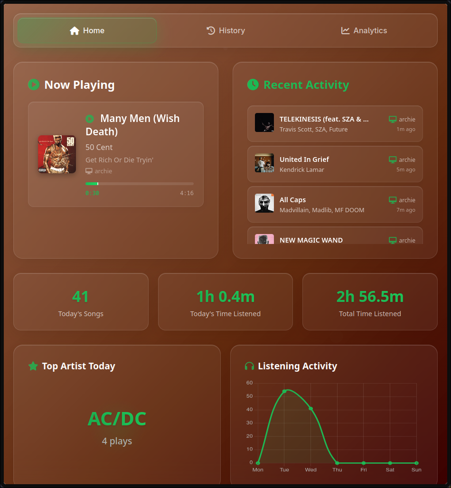

# 🎵 Spotify Tracker

A comprehensive Spotify song tracking application that automatically monitors your listening history, stores it in a database, and provides real-time updates with playback control capabilities.

## 📷 Screenshots
<table align="center">
  <tr>
    <td colspan="4"></td>
  </tr>
  <tr>
    <td colspan="1"></td>
    <td colspan="1"></td>
    <td colspan="1" align="center"></td>
    <td colspan="1" align="center"></td>
  </tr>
</table>

## ✨ Features

### 🎧 Core Functionality
- **Automatic song tracking**: Detects and records when you start playing new songs
- **Database storage**: Stores all played songs with detailed metadata and timestamps
- **Real-time updates**: WebSocket-powered instant updates when new songs are detected
- **Listening statistics**: Tracks total listening time, completion rates, and daily stats

### 🎵 Playback Control
- **Direct playback**: Play any song from your history directly on your Spotify device
- **Smart search**: Uses stored Spotify URIs when available, falls back to search
- **Device detection**: Automatically finds your active Spotify device
- **Visual feedback**: Button animations show current playback state

### 📊 Data Management
- **Comprehensive metadata**: Track names, artists, albums, devices, and album covers
- **Duration tracking**: Records actual listening time vs. total track duration
- **Completion tracking**: Identifies songs played to completion (90%+ listened)
- **Timezone support**: All timestamps in Berlin timezone (configurable)

### 🌐 Web Interface
- **Current song display**: Shows currently playing song with progress bar
- **Song history**: Displays recent songs with filtering and search
- **Statistics dashboard**: Shows listening time, completion rates, and trends
- **Responsive design**: Works on desktop and mobile devices

## 🚀 Quick Start

### Prerequisites
- **Python 3.7+**
- **Spotify Premium account** (required for playback control)
- **Active Spotify device** (phone, computer, speaker, etc.)

### 1. Installation

```bash
# Clone the repository
git clone https://github.com/OlaYZen/Spotify-Tracker
cd Spotify-Tracker

# Install dependencies
pip install -r requirements.txt
```

### 2. Spotify API Setup

1. **Create Spotify App**:
   - Go to [Spotify Developer Dashboard](https://developer.spotify.com/dashboard)
   - Click "Create App"
   - Fill in app details (name, description, website)
   - Add `http://127.0.0.1:8888/callback` to Redirect URIs (or use your own custom domain, e.g. `https://yourdomain.com/callback`)

2. **Configure Environment**:
   ```bash
   # Create .env file
   mv .env.example .env
   ```
   
   Edit `.env` with your credentials:
   ```env
   SPOTIPY_CLIENT_ID=your_client_id_here
   SPOTIPY_CLIENT_SECRET=your_client_secret_here
   SPOTIPY_REDIRECT_URI=http://localhost:8888/callback
   LOG_LEVEL=ERROR
   PORT=5000
   ```

### 3. Run the Application

```bash
# Start both web server and tracker (recommended)
python run.py
```

Or run manually in separate terminals:
```bash
# Terminal 1: Web server
python app.py

# Terminal 2: Spotify tracker
python tracker.py
```

### 4. Access the Interface

Open [http://localhost:5000](http://localhost:5000) in your browser.

**First time setup**: You'll be prompted to authorize the app with Spotify. The new permissions include playback control for the play button feature.

## 🎮 How to Use

### Current Song Display
- **Real-time progress**: Shows current song with progress bar and time
- **Device info**: Displays which device is currently playing
- **Album artwork**: High-quality album cover images

### Song History
- **Recent activity**: View your latest listening history
- **Play buttons**: Click the green 🎵 button to play any song
- **Filtering**: Filter by date, artist, or album
- **Detailed info**: See listening duration and completion status

### Play Button Feature
- **🎵 Green button**: Ready to play
- **⏳ Spinning**: Loading/sending command
- **✅ Check**: Successfully started playback
- **❌ Error**: Shows notification with error details

### Statistics
- **Total listening time**: All-time and today's listening duration
- **Completion rate**: Percentage of songs played to completion
- **Song counts**: Total songs and completed songs

## ⚙️ Configuration

### Environment Variables

| Variable | Description | Default |
|----------|-------------|---------|
| `SPOTIPY_CLIENT_ID` | Spotify API Client ID | Required |
| `SPOTIPY_CLIENT_SECRET` | Spotify API Client Secret | Required |
| `SPOTIPY_REDIRECT_URI` | OAuth redirect URI | `http://localhost:5000/callback` |
| `PORT` | Web server port | `5000` |
| `SPOTIFY_TIMEOUT` | API timeout (seconds) | `30` |
| `LOG_LEVEL` | Logging level | `ERROR` |

### Changing the Port

1. Update `PORT` in `.env` file
2. Update `SPOTIPY_REDIRECT_URI` to match new port
3. Update redirect URI in Spotify Developer Dashboard
4. Restart the application

## 📡 API Endpoints

| Endpoint | Method | Description |
|----------|--------|-------------|
| `/` | GET | Main web interface |
| `/api/current-song` | GET | Currently playing song (JSON) |
| `/api/history` | GET | Recent song history (JSON) |
| `/api/listening-stats` | GET | Listening statistics (JSON) |
| `/api/play-song` | POST | Play a specific song |
| `/api/test-websocket` | GET | Test WebSocket functionality |

### WebSocket Events

| Event | Description |
|-------|-------------|
| `connect` | Client connects to WebSocket |
| `disconnect` | Client disconnects from WebSocket |
| `new_songs_detected` | New songs added to database |
| `connected` | Connection confirmation |

## 🐛 Troubleshooting

### Common Issues

**"No active Spotify device found"**
- Solution: Open Spotify on any device first

**"Spotify Premium is required"**
- Solution: Upgrade to Spotify Premium (API requirement)

**"App needs additional permissions"**
- Solution: Delete `.cache` file and re-authorize

**"Track not found"**
- Solution: Song might not be available on Spotify anymore

**Spotify API Timeouts**
- Increase `SPOTIFY_TIMEOUT` in `.env` file
- Check internet connection
- App automatically retries with longer delays

**Rate Limiting**
- App automatically waits longer between requests
- Consider reducing API call frequency if needed

## Logging

All operations are logged to `output.log` with:
- Berlin timezone timestamps
- Configurable log levels
- Detailed error information
- WebSocket event tracking

## 📄 License

This project is licensed under the MIT License - see the [LICENSE](LICENSE) file for details.

## 🤝 Contributing

1. Fork the repository
2. Create a feature branch
3. Make your changes
4. Test thoroughly
5. Submit a pull request

## 📞 Support

For issues and questions:
- Check the troubleshooting section above
- Review the logs in `output.log`
- Open an issue on GitHub

---

**🎉 Enjoy your enhanced Spotify Tracker with direct playback control!** 